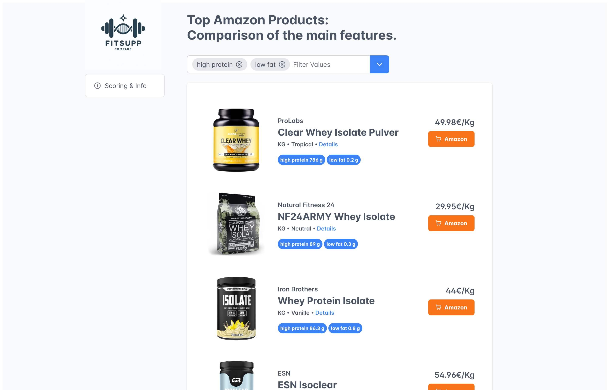

# Product Filter Tool

Working on a simple tool where I can filter product features using a specific scoring system.
It's build with Vue, Typescript, Primevue, TailwindCss and Airtable as Database.

## Here's an example with Filter strategies for a whey product:

### Filter "Protein":
- Assigned value: "protein"
- Desirability of high ingredient values: good
- Importance of scoring value: 10

### Filter "Fat":
- Assigned value: "fat"
- Desirability of high ingredient values: bad
- Importance of scoring value: 6

Products with higher protein content will receive a higher rank in the filtered list compared to products with lower fat content.